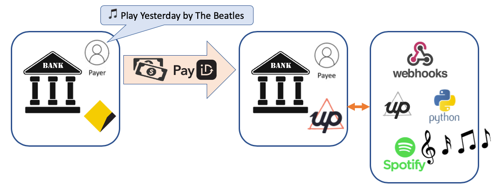
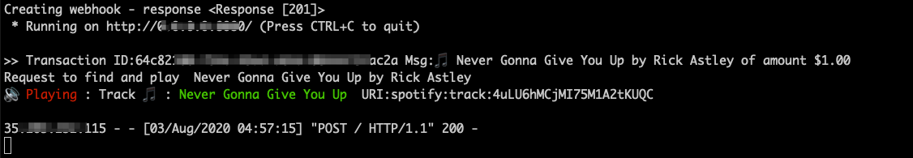

# Up Next
Picking the next Spotify song to play using the [UP Bank](https://up.com.au/) [API](https://developer.up.com.au/#getting-started)

Building a music jukebox and selecting the next song with a bit of 🎼

# Overview



# Setup

## Initial Python Setup
```
which python3

virtualenv -p `which python3` venv
source venv/bin/activate
python --version
pip --version
pip install -r requirements.txt
```

## Secrets
Copy `config-example.py` to `config.py` and 

## UP Bank API Setup
Review [Getting Started](https://developer.up.com.au/#getting-started)

```
python banklistener.py
```


## Spotify Setup
```
python banklistener.py
```

# In Action

