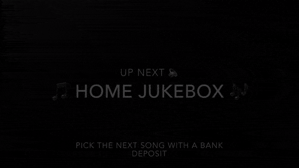
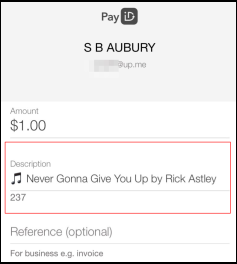

# Up Next
Picking the next Spotify song to play using the [UP Bank](https://up.com.au/) [API](https://developer.up.com.au/#getting-started)

Build a music jukebox and select the next song with a bit of 🎵 and a small amount of 💲. Using real time banking APIs to select the next song to play. A home jukebox made with a few lines of Python.





# Overview


Register a webhook to intercept payments. Parse the payment description and seach for the track in Spotify. Add song to playlist and enjoy the music.


# In Action

## Payment

Make a payment; with the song request in the description field
```
🎵 Never Gonna Give You Up by Rick Astley
```



And within 2 or 3 seconds; the funds are recived by the _payee_ (thank you real time banking!) A webhook quickly parses the song request and starts the requested song on Spotify.


# Setup


## Initial Python Setup
```
which python3

virtualenv -p `which python3` venv
source venv/bin/activate
python --version
pip --version
pip install -r requirements.txt
```

## Secrets
Copy `config-example.py` to `config.py` and 

## UP Bank API Setup
Review [Getting Started](https://developer.up.com.au/#getting-started). Start the application with

```
python banklistener.py
```


## Spotify Setup
Review [create Spotify integration](https://developer.spotify.com/dashboard/login) to generate and establish tokens. You can test just the Spotify setup with

```
python spotifyapp.py
```
